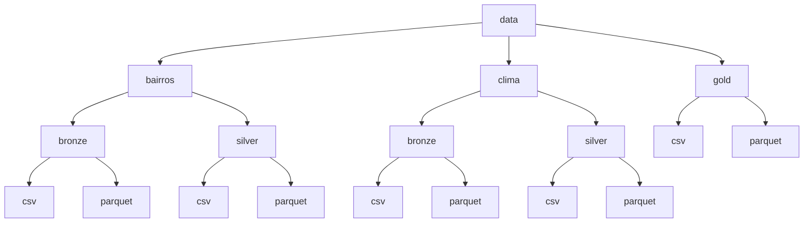

# Análise de Temperatura Urbana por Bairro

## Projeto de Engenharia de Dados

## Visão Geral

Este projeto analisa a variação de temperatura entre os bairros da cidade de São Paulo, com o objetivo de identificar quais regiões sofrem mais com o calor e quais apresentam maior conforto térmico. A análise gera insights que podem apoiar estudos urbanos, planejamento público e avaliações sobre qualidade de vida.

O projeto foi desenvolvido com foco em Engenharia de Dados, utilizando pipelines de ETL, organização em camadas (Bronze, Silver e Gold) e armazenamento eficiente dos dados.

## Ambiente de Desenvolvimento

O projeto foi desenvolvido e executado no Google Colab, facilitando a experimentação, o processamento de dados e a reprodutibilidade.

## Objetivo do Projeto

O objetivo deste projeto é desenvolver um pipeline de engenharia de dados capaz de:

* Coletar dados geográficos de bairros urbanos
* Integrar dados meteorológicos de temperatura e sensação térmica
* Tratar e validar a qualidade dos dados  
* Analisar e identificar bairros com maior estresse térmico e bairros mais frescos
* Gerar rankings e visualizações que facilitem a interpretação dos resultados

O projeto começa com a cidade de São Paulo, mas foi estruturado para ser facilmente escalável para outras capitais brasileiras.

## Tecnologias Utilizadas

* Python
* Pandas
* Google Colab
* CSV
* Parquet
* Jupyter Notebook

## Arquitetura e Metodologia  (Medallion Architecture)

O pipeline segue a arquitetura Bronze–Silver–Gold, amplamente utilizada em projetos de engenharia de dados:

**Bronze:** dados brutos extraídos das fontes externas

**Silver:** dados limpos, padronizados e auditados

**Gold:** dados analíticos, agregações e resultados finais
Além disso, o projeto implementa um fluxo completo de ETL (Extract, Transform, Load), com auditoria de qualidade entre as etapas.

## Estrutura do Repositório

Criado por Letícia ❤️ | 🔗 [@lettymoon](https://github.com/lettymoon) | 📧 [leticiahcandido@gmail.com](mailto:leticiahcandido@gmail.com)
